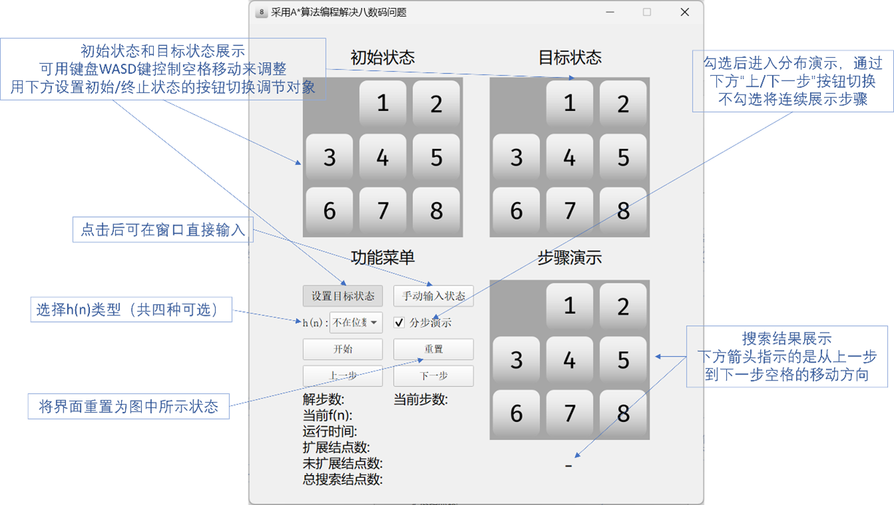

# 说明

2024年春季学期“机器智能课程设计”实验二“采用A*算法编程解决八数码问题”项目文件

## 各模块作用

### resource

存储前端运行所以来的png图片，以及程序图标ico文件

#### 8_digits.exe

打包完成的exe程序（运行需要resource）

#### check.py

check模块，包含用于检查问题可解性和输入合法性的函数

#### debug.py

debug模块，用于开发阶段的调试和性能检测

#### main.py

main模块，包含了前端功能的实现与对后端算法的调用

#### mainUI.py

mainUI模块，前端界面的搭建与初始化

#### path_search.py

path_search模块，A*算法的实现，以及对搜索结果的处理

## 前端操作

